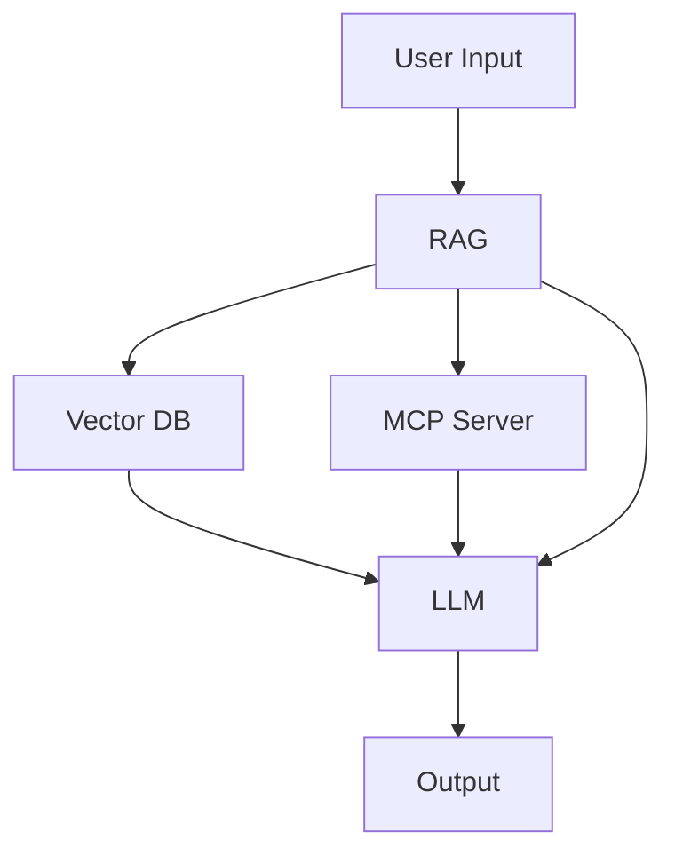

+++ 
draft = false
date = 2025-08-19T17:22:50-04:00
title = ""
description = ""
slug = ""
authors = []
tags = []
categories = []
externalLink = ""
series = []
+++

# From Input to Insight: Exploring AI and LLMs
  <!-- Inside AI Magic: Understanding LLM Processing -->

Have you ever wondered how AI chatbots can grasp your questions and reply so effectively? This guide walks you through how they work, starting with basic ideas and moving to deeper technical insights. These chatbots backed by LLM's processes information in a structured order, drawing on multiple sources to improve its responses. Each step below is enhanced with concepts from [How LLMs see the world](https://blog.bytebytego.com/p/how-llms-see-the-world?utm_source=publication-search), including in-depth details on tokens, embedding, positioning, and transformer mechanics.

## Table of contents

- [Overview of LLM processing](#visual-overview-of-llm-processing-flow)
- [Understanding AI basics](#ai-made-simple-understanding-the-flowchart-and-transformers-with-a-library-analogy)
- [Core components of LLMs](#component-spotlights-key-elements-of-the-llm-process)
- [Exploring AI models and technology](#llm-landscape-comparing-leading-models)
- [Agentic AI and workflows](#agentic-systems-and-automated-workflows)
- [References](#references)

---

## Visual overview of LLM processing flow



```dot
digraph G {
    rankdir=TB;
    Input [label="User Input"];
    RAG [label="RAG"];
    VectorDB [label="Vector DB"];
    MCP [label="MCP Server"];
    LLM [label="LLM"];
    Output [label="Output"];
    Input -> RAG;
    RAG -> VectorDB;
    RAG -> MCP;
    VectorDB -> LLM;
    MCP -> LLM;
    RAG -> LLM;
    LLM -> Output;
}


## AI made simple: Understanding the flowchart and transformers with a library analogy

This analogy provides a foundational understanding of AI processes. As we progress, we'll explore the technical details behind these components.

Whether you're new to technology or just curious, understanding how intelligent language systems like chatbots or AI assistants operate can feel a bit overwhelming at first. Let's simplify it by breaking down the flowchart in this document and the concept of "transformers" (the core engine behind these systems) using relatable, everyday examples.

**The Flow Chart Explained – Like a Helpful Team at a Library:**
Our flowchart shows the steps an AI system takes to answer your questions. Imagine you’re at a magical library where a team works together to help you:

- **User input:** This is you walking up to the librarian’s desk with a question, like “Tell me about dinosaurs.”
- **RAG (Retrieval-Augmented Generation):** The head librarian doesn’t just guess the answer. They decide if they need extra books or articles to give you the best information. They send a helper to look for these resources.
- **Vector DB (Database):** This is like a super-organized shelf of books and notes where everything is sorted by topics, not just titles. The helper quickly finds books about dinosaurs by matching the “idea” of your question to the right resources, even if you didn’t use the exact words.
- **MCP Server:** Sometimes, the librarian calls a special expert—like a paleontologist—for up-to-date or unique facts about dinosaurs that aren’t in the library books.
- **LLM (Large Language Model):** Now, the head librarian gathers all the information—from their own memory, the books, and the expert—and carefully thinks about how to explain it. They craft a clear story or answer about dinosaurs.
- **Output:** Finally, the librarian shares the answer in simple words, making it easy to understand, like “Dinosaurs were huge creatures that lived millions of years ago…”

The arrows in the flowchart show how information moves from you, through the team, and back with an answer. The whole team collaborates to ensure the answer is thorough and accurate.

**How Transformers Work – Continuing the Library Analogy:**
Transformers are the “thinking engine” inside the LLM part of our flowchart. They’re not a physical thing but a clever way the computer learns to understand and create language. Building on our library analogy, let’s see how a master librarian within this magical library expertly processes every detail of your question to craft the perfect response.

- **Cataloging words:** When you ask a question, the master librarian breaks it down into individual pieces (like words) and organizes each piece into a detailed catalog card that holds its meaning.
- **Tracking the order:** They also note the order of these pieces (knowing “dog chases cat” differs from “cat chases dog”) by labeling each card with its position in the sequence.
- **Linking ideas:** The librarian examines every catalog card and connects related ideas, no matter how far apart they are. For example, in “The big dog barked,” they link “big” to “dog” to clarify it’s not a small dog, ignoring unrelated words in between.
- **Analyzing from multiple angles:** They review the question from different perspectives simultaneously—one for overall meaning, another for how words connect—ensuring no detail is overlooked.
- **Crafting the response:** Piece by piece, the librarian builds the answer, always checking the full set of cards to make sure each new word fits perfectly, like assembling a puzzle with precision.
- **Delivering the answer:** Finally, they put all the pieces together into a clear, well-organized response and share it with you in simple terms.

This library magic happens incredibly fast inside the computer, allowing it to chat with you, write content, or answer nearly any question by understanding language in a human-like way. That’s the power of transformers—they enable AI to communicate with us naturally.

Now that we've covered the basics, let's dive deeper into the technical components that power the LLM process. Think of these as the behind-the-scenes machinery in our magical library, working together to answer your questions with precision.

---

## Component Spotlights: Key Elements of the LLM Process

### User Input

Users interact with the LLM by providing prompts in natural language.  

- **Tokenization**: The system breaks the input into *tokens*, mapping words, subwords, or characters to unique integers. This is essential, as LLMs can only work with numbers, not raw text.
- **Example**: The phrase "LLMs are amazing!" could be tokenized as [18472, 44, 3256, 29991].
- **Purpose**: These token IDs are then used as the starting point of the deep learning process.

### RAG (Retrieval-Augmented Generation)

When extra knowledge is needed beyond the LLM's training, *RAG* augments the prompt:

- **Embedding the query**: The user’s tokenized input is transformed into dense *vectors* (*embeddings*) that encapsulate semantic meaning.
- **Semantic retrieval**: The embedding is used to semantically match relevant documents or facts from large knowledge stores, not just by word overlap but by meaning.
- **Context addition**: The retrieved knowledge snippets are tokenized and embedded, then added to the context for the LLM to use during reasoning.

### Vector DB

The *vector database* powers semantic search:

- **Storing embeddings**: It contains vast collections of knowledge, each item pre-embedded into *vectors*.
- **Similarity search**: When a query comes in, it is embedded and the DB rapidly finds vectors (documents/facts) that are closest in meaning to the query.
- **Contextual injection**: The most relevant chunks are provided as *tokens* and *embeddings* for the LLM to attend to.

### MCP Server

For live, dynamic, or specialized data, the system calls the *MCP Server*:

- **Access provision**: Provides access to tools (*APIs*, calculators, real-time data sources) or proprietary datasets not within the standard training or vector DB.
- **Data processing**: These results are processed—tokenized and embedded—and then injected into the token stream/context considered by the LLM, offering real-time augmentation.

### LLM (Large Language Model)

The heart of the system runs on *transformer architecture*:

- **Embeddings**: All tokens from user input, contextual passages (RAG/VectorDB), and MCP tools are turned into *embeddings*—numerical vectors that encapsulate meaning.
- **Positional encoding**: Since transformers process input in parallel and are position-agnostic by nature, *positional encodings* are added to preserve the order of tokens, so the model knows "who came before whom".
- **Transformer attention**: Core innovation—*attention mechanisms* let the model weigh and relate every token in the sequence to every other for each new output token, identifying which facts or passages are most relevant at every step.
- **Autoregressive generation**: At each inference step, the LLM predicts the next token based on all previously seen tokens and context—building up the output, token by token.
- **Chain of Thought (CoT) prompting**: A technique called *Chain of Thought prompting* can be applied within this processing stage. CoT involves structuring the input prompt or guiding the model to articulate its reasoning process step-by-step before providing a final answer. This method is particularly useful for complex tasks requiring logical deduction, mathematical reasoning, or multi-step problem-solving.
  - **Example**: When faced with a math problem, the model might be prompted to "think aloud" by breaking down the problem into smaller parts, solving each part, and then combining the results.
  - **Benefit**: CoT enhances transparency and often improves accuracy by mimicking human-like reasoning patterns. It is typically integrated during the input formulation (as part of the User Input stage) or as a strategy within the LLM's internal processing to structure the generation of tokens in a logical sequence.

### Output

The LLM produces its final prediction:

- **Outcome**: The result is a sequence of predicted *tokens*, which are then mapped back to human-readable text via *detokenization*.
- **Impact**: This process empowers LLMs to generate highly contextual, relevant, and coherent responses—grounded in user input, retrieved/contextual documents, external knowledge, and deep language modeling.

---

## LLM landscape: Comparing leading models

| Model                | Creator                    | Number of Parameters    | Key Characteristics / Strengths                                          |
|----------------------|---------------------------|------------------------|--------------------------------------------------------------------------|
| GPT-3                | OpenAI                    | 175B                   | General-purpose, pioneered language generation at scale.                 |
| GPT-4                | OpenAI                    | ~1T (est. 500B+)       | Multimodal (text/image), improved accuracy, creative, steerable.         |
| PaLM 2               | Google                    | 340B                   | Excels in logic, coding, multilingual understanding.                     |
| Gemini (Pro/Ultra)   | Google                    | Up to ~1.56T (Ultra)** | Multimodal, advanced reasoning and search integration.                   |
| LLaMA 2              | Meta (Facebook)           | 7B – 70B               | Fast, open, efficient, widely used for research and customization.       |
| Claude 2/Opus        | Anthropic                 | ~52B+ (Claude 2), ? Opus| Aligned for safety, very long context windows (200k+ tokens).            |
| Falcon               | TII (Abu Dhabi)           | 40B – 180B             | Open-source, highly efficient, strong at benchmarks.                     |
| MPT                  | MosaicML                  | 7B – 30B               | Modular, commercial-use, stable for production.                          |
| BLOOM                | BigScience org.           | 176B                   | Multilingual, collaborative open-science.                                |
| Perplexity LLM/PPLX  | Perplexity AI             | 70B (“PPLX-70B”)       | Open-source, strong for web-augmented QA and fast API search.            |

**Note**: Some parameter numbers for new or proprietary models, such as Gemini and Claude Opus, are estimates from public reporting or have not been fully disclosed.

- GPT-3/4 (OpenAI): Lead in general-purpose performance, creativity, and ecosystem support.
- PaLM 2 & Gemini (Google): Advanced logic, coding, real-time and search grounding.
- LLaMA 2 (Meta): Efficient, easy to fine-tune, widely adopted.
- Claude 2/Opus (Anthropic): Long context handling, safety and truthful dialogue focus.
- Falcon (TII): Efficient and accessible for research/production.
- MPT (MosaicML): Modular, stable, business-friendly licensing and support.
- BLOOM (BigScience): Open, multilingual, global collaborative model.
- Perplexity LLM: QA-focused, practical for information retrieval, lightweight, strong for web search tasks.

---

## Deep dive: How transformer architecture powers AI

Transformers are the foundation of modern LLMs, introduced in the seminal paper [Attention is All You Need (2017)](https://proceedings.neurips.cc/paper_files/paper/2017/file/3f5ee243547dee91fbd053c1c4a845aa-Paper.pdf). They revolutionized natural language processing by replacing sequential processing (like in older models such as Recurrent Neural Networks (RNNs) or Long Short-Term Memory networks (LSTMs)) with **parallel processing**, leveraging **attention mechanisms** to model relationships between words, no matter how far apart they are in a sentence. This section expands on concepts from ["How Transformers Architecture Works"](https://blog.bytebytego.com/i/163736711/how-transformers-architecture-works) to provide a deeper understanding.

**Core Structure and Workflow:**
Transformers consist of an *Encoder* and a *Decoder*, each made up of multiple layers. The encoder processes the input sequence, while the decoder generates the output sequence. In many LLMs, especially *autoregressive models* like GPT, often only the decoder part is used for tasks like text generation.

- **Token embeddings**: Each input *token* (word or subword) is converted into a high-dimensional vector (e.g., 512 or 768 dimensions) that captures its semantic meaning. Think of this as translating words into a "language" of numbers that a computer can understand.
- **Positional encoding**: Since transformers process all tokens simultaneously (not sequentially), they add *positional information* to embeddings to indicate the order of words in a sentence. This can be a fixed sinusoidal function or learned during training, ensuring the model knows "where" each token is in the sequence.
- **Self-attention mechanism**: The heart of transformers, *self-attention* allows each token to "look at" every other token in the input to determine its relevance.
  - **Example**: In the sentence "The cat, which is black, sat on the mat," the word "cat" pays high attention to "black" and "sat" despite their distance.
  - **Method**: This is computed using *Query*, *Key*, and *Value* matrices derived from the embeddings.
- **Multi-head attention**: Instead of a single attention mechanism, transformers use multiple "*heads*" (e.g., 8 or 12) to capture different types of relationships.
  - One head might focus on nearby words (*syntax*), another on distant words (*semantics*), providing a richer understanding of context.
- **Feed-forward neural networks (FFNNs)**: After attention, each token's representation passes through a small *neural network* (specific to its position) to further transform and refine the data. This introduces non-linearity and helps the model learn complex patterns.
- **Layer normalization and residual connections**: Each sub-layer (attention or FFNN) is followed by *normalization* to stabilize training and *residual connections* (adding the input back to the output) to help gradients flow through deep networks, preventing vanishing gradient issues.
- **Stacking layers**: A transformer typically has multiple encoder/decoder *layers* (e.g., 6 to 96), each repeating attention and FFNN steps. Deeper layers capture increasingly abstract features, from local word relationships to global sentence meaning.
- **Output prediction (Softmax layer)**: For generation tasks, the final decoder layer outputs a *probability distribution* over the vocabulary for the next token. The token with the highest probability is chosen (or sampled), and the process repeats *autoregressively* until the output is complete.

**Analogy for Understanding:**
Imagine a transformer as a highly efficient librarian team:

- **Token embeddings** are like translating each word of your question into a detailed index card.
- **Positional encoding** marks each card with its position in your sentence, so order isn't lost.
- **Self-attention** is the team cross-referencing every card with every other to see which ideas connect most strongly, no matter how far apart.
- **Multi-head attention** means different librarians focus on different connections (one on grammar, another on meaning).
- **Feed-forward layers** are like each librarian refining their notes before passing them on.
- **Stacking layers** is passing these notes through multiple teams, each adding deeper insight.
- Finally, **Output prediction** is the head librarian writing the best next word based on all insights, continuing until the answer is complete.

**Summary Table:**

| Concept                | What it Does                                                  |
|------------------------|--------------------------------------------------------------|
| Token Embedding        | Converts text/tokens to numerical vectors for model input    |
| Positional Encoding    | Encodes word order to preserve sequence context              |
| Self-Attention         | Links each token to all others based on relevance            |
| Multi-Head Attention   | Captures multiple relationship types via parallel attention  |
| Feed-Forward Layer     | Refines each token’s representation with non-linear changes  |
| Layer Normalization    | Stabilizes training by normalizing layer outputs             |
| Residual Connections   | Adds input to output to help training deep networks          |
| Layer Stacking         | Builds depth for complex understanding across many layers    |
| Output Prediction      | Computes the next token/word for human-like language output  |

Transformers’ ability to parallelize processing, scale to billions of parameters, and focus on contextual relationships through attention makes them exceptionally powerful for language understanding and generation, powering today’s most advanced LLMs.

**Key Takeaway**: Transformers are the heart of modern AI language systems, enabling them to understand context and generate human-like responses by processing words in parallel and focusing on what matters most in a sentence.

---

## Agentic systems and automated workflows

As Generative AI continues to evolve, two significant advancements—Automated Workflows and Agentic AI—have emerged, pushing the boundaries of what AI systems can achieve. These developments represent a shift from passive response generation to proactive, autonomous, and systematic interaction with users and environments, reflecting a sequential progression in AI capabilities.

**Automated workflows: Streamlining processes with AI**
Automated Workflows represent an early yet powerful step in embedding AI into structured, repeatable processes to boost efficiency across various fields. This innovation automates tasks that once needed human oversight, evolving from basic rule-based systems to leveraging AI's generative and reasoning strengths. Key aspects include:

- **Task automation**:
  - Early workflows handled simple tasks like scheduling or data entry.
  - With AI, they now draft documents, generate reports, or create content using predefined templates or triggers, minimizing manual work.
  - Example: A workflow can auto-generate a monthly sales report by pulling data (via MCP Server or Vector DB), analyzing it with the LLM, and formatting the output.
- **Decision support**:
  - These workflows embed decision-making logic, using AI to assess options and propose actions.
  - They align with the "RAG" and "LLM" stages of our flowchart, retrieving and processing external data to guide decisions.
- **Integration with systems**:
  - Workflows link AI with business tools (like CRMs, ERPs) to manage complete processes.
  - Example: Resolving customer support tickets by handling user input, fetching relevant data, crafting a response, and updating the system.

Automated Workflows mark a crucial evolution, shifting AI from standalone tasks to systemic integration, becoming a vital component of operational pipelines and enhancing productivity and consistency.

**Agentic AI: Autonomous decision-making agents**
Building on automated systems, Agentic AI marks a cutting-edge advancement where AI operates as autonomous agents, making decisions, taking actions, and pursuing goals with minimal human input. Unlike traditional Generative AI or automated workflows that react to predefined triggers, Agentic AI stands out with its proactive nature. Key capabilities include:

- **Set goals and plan**:
  - These systems define objectives based on user input or environmental context.
  - They craft step-by-step plans to achieve goals independently.
  - Example: An Agentic AI could plan a travel itinerary by researching destinations, booking flights, and suggesting activities—all without needing detailed human guidance.
- **Interact with tools and environments**:
  - Agentic AI connects with external tools, APIs, and systems (similar to the MCP Server in our workflow).
  - It performs tasks like sending emails, updating databases, or controlling smart devices.
- **Adapt and learn**:
  - Through ongoing interaction and feedback, it refines strategies.
  - It learns from successes and setbacks to enhance future performance.

Within our flowchart, Agentic AI goes beyond the "LLM" and "Output" stages, looping back to "User Input" or other components as needed to handle multi-step tasks autonomously. This evolution transforms AI from a mere responder or workflow element into a proactive partner, adept at managing complex, multi-turn interactions or projects.

**Evolution of Generative AI with Automated Workflows and Agentic AI**
The progression of Generative AI can be seen as a sequential journey from basic automation and text generation to sophisticated, goal-oriented, and autonomous systems:

- **Early Stage - Automation and Basic Tools:** Before advanced AI, automation relied on rule-based systems and simple scripts for repetitive tasks, setting the stage for integrating intelligence into workflows.
- **Content Generation with Generative AI:** Early Generative AI models, such as GPT-2, focused on producing text or media based on prompts, mainly operating at the "LLM" and "Output" stages of our workflow.
- **Contextual Enhancement:** With techniques like RAG and Vector DB, AI evolved to incorporate external knowledge, making responses more informed and relevant—a significant step in handling real-world queries.
- **Systemic Integration (Automated Workflows):** Automated Workflows integrate Generative AI into broader operational frameworks, automating multi-step processes and linking all parts of our flowchart (from Input to Output) into streamlined, efficient systems, building on earlier automation concepts.
- **Autonomous Interaction (Agentic AI):** The emergence of Agentic AI represents a significant shift towards autonomy, where AI systems proactively manage tasks, make decisions, and interact with environments, transforming the traditional workflow into adaptive, self-directed cycles.

Together, Automated Workflows and Agentic AI represent critical milestones in the evolution of Generative AI, transforming it from a tool for creation into a partner for action and automation. They build on the foundational capabilities of LLMs, enhancing their practical utility in personal, professional, and industrial contexts, with workflows providing the structure and Agentic AI adding the autonomy.

---

## Conclusion: Exploring AI's impact

As you've seen, the journey of an LLM from understanding your input to crafting a response is a complex yet fascinating process. These systems are transforming how we interact with technology, from personal assistants to professional tools.

## Glossary of key terms

To help clarify some of the technical concepts discussed, here are brief definitions of important terms used throughout this document:

- **Tokenization**: The process of breaking down text into smaller units (tokens, like words or subwords) and converting them into numbers for the AI to process.
- **Embeddings**: Numerical representations of words or phrases that capture their meaning, allowing AI to understand relationships between them.
- **Positional Encoding**: A method to add information about the order of words in a sentence, since transformers process all words simultaneously and need to know their sequence.
- **Self-Attention**: A mechanism that lets the AI focus on relevant words in a sentence by weighing their importance to each other, regardless of their position.
- **Autoregressive Generation**: A technique where the AI predicts the next word (or token) based on all previously generated words, building sentences step by step.
- **RAG (Retrieval-Augmented Generation)**: A method where AI retrieves relevant external information to enhance its responses beyond its trained knowledge.

## References

This document draws inspiration and technical insights from the following sources:

- [How LLMs see the world](https://blog.bytebytego.com/p/how-llms-see-the-world?utm_source=publication-search) - Provides detailed explanations on tokens, embeddings, positioning, and transformer mechanics.
- [How Transformers Architecture Works](https://blog.bytebytego.com/i/163736711/how-transformers-architecture-works) - Offers an in-depth look at the transformer architecture that powers modern LLMs.
- [Attention is All You Need (2017)](https://proceedings.neurips.cc/paper_files/paper/2017/file/3f5ee243547dee91fbd053c1c4a845aa-Paper.pdf) - Introduces the transformer model and attention mechanisms fundamental to modern LLMs.
